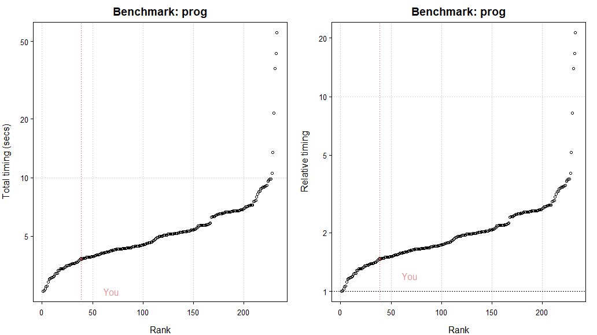
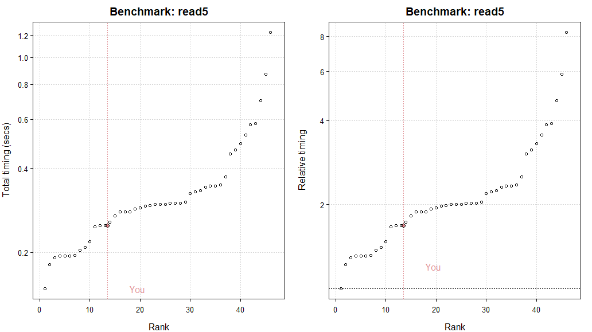
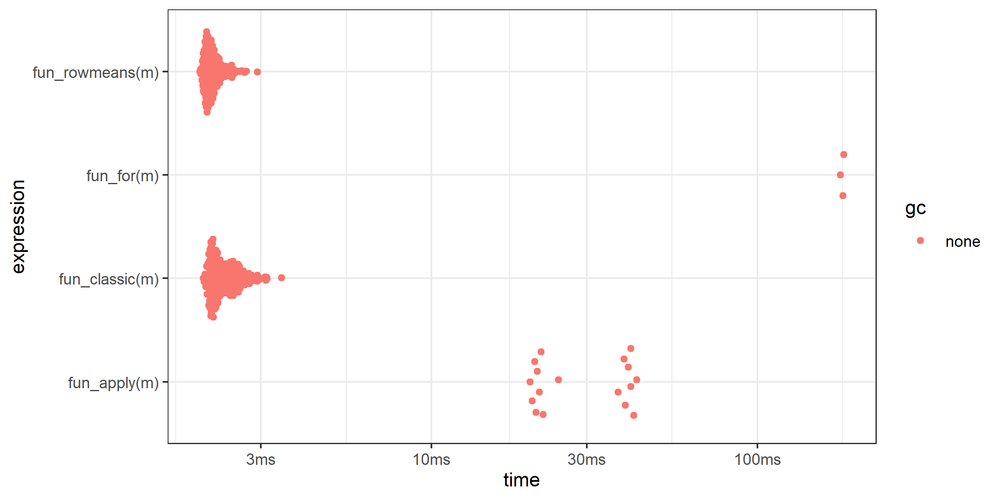
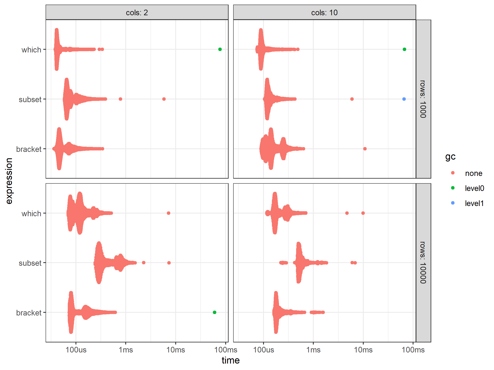

```{r setup, include=FALSE, message = FALSE, warning=FALSE}
options(htmltools.dir.version = FALSE)
library(tidyverse)
library(tictoc)
library(microbenchmark)
library(benchmarkme)
library(bench)
library(data.table)
library(kableExtra)
```

## Workshop

This workshop consists of three parts:

1. Benchmarking &  Profiling
2. Introduction to Vectorization & the Power of C++ with `Rcpp`
3. Introduction to Parallelization with `foreach()`

<!-- *********** NEW SLIDE ************** -->
---
## Learning Goals

At the end of this workshop, you should ...

- know how to measure the speed of your R Code and find potential bottlenecks

- know how to solve those bottlenecks through vectorized `R` code, Rcpp, or parallelization


<!-- *********** NEW SLIDE ************** -->
---
## Some thoughts about optimization

.pull-left[

- Can save a lot of time, but also can waste a lot of time

- There is often no single-best solution

- Still often worth to profile your functions or simulation code


]
.pull-right[


from [xkcd](https://xkcd.com/)
]


<!-- *********** HEADING ************** -->
---
class: heading,middle


Part 1: Benchmarking &  Profiling


<!-- *********** HEADING ************** -->
---
class: heading,middle

Tip 1: Hardware


<!-- *********** NEW SLIDE ************** -->
---
## Think about your hardware

- As you will see throughout this workshop, optimizing your R Code can be (will be) very time consuming

- An easy way to improve the speed of your code, is having up-to-date hardware

- Q: How can do you know if your computer is up-to-date ?

- A: The `benchmarkme`- package 

<!-- *********** NEW SLIDE ************** -->
---
class: small
## benchmarkme - package 

.pull-left[


The [`benchmarkme`](https://github.com/csgillespie/benchmarkme) - package allows you to run a set of standardized benchmarks and compare your results to other users. 

```{r eval = FALSE}
library(benchmarkme)

## Number of Cores
get_cpu()

## Number of RAM
get_ram()

## Acess the speed of some functions,
## i.e. numerical operations such as loops
## and matrix operations) ...
bench_std <- benchmark_std(runs = 1)

##  ... reading of files
bench_file <- benchmark_io(runs = 1, size = 5)

## Compare with others
plot(bench_std)
plot(bench_file)

## Upload your results (if you want)
upload_results(bench_std)
upload_results(bench_file)
```
] 
.pull-right[

Example from my computer: 
.center[



]

]


<!-- *********** HEADING ************** -->
---
class: heading,middle

Tip 2: Compare possible functions

<!-- *********** NEW SLIDE ************** -->
---
## Benchmarking 

We will look at three functions for benchmarking your R Code:

- `system.time()`
- `tic()`and `toc()`
- `mark()`


<!-- *********** NEW SLIDE ************** -->
---
class:small
## system.time()

`system.time()` returns the time taken to evaluate/run any R expression

.pull-left[
Either for single statements

```{r}
system.time(sqrt(1:1e7))
```


Or entire bits of code


```{r}
system.time({ #<<
  
  mat1 <- matrix(rep(1:100,1e6),ncol=500)
  mat2 <- matrix(rep(1:100,1e6),ncol=500)
 
  mat1 * mat2
  
})#<<
```
]

--


.pull-right[
- **User**: gives the CPU time spent by the current process (i.e., the current R session)

- **System**: gives the CPU time spent by the the operating system on behalf of the current process (e.g., opening files, doing input or output, starting other processes, and looking at the system clock).

- **Elapsed**: "Wall clock time" 

```{r}
system.time(
  Sys.sleep(10) #do nothing for 10 seconds
  )
```
]


<!-- *********** NEW SLIDE ************** -->
---
class:small
## tic() - toc()

- A more convinient way than `system.time()` are the functions `tic()`and `toc()`  from the `tictoc`-package

.pull-left[
Again you can measure single statements

```{r}
library(tictoc)

tic()#<<

a <- sqrt(1:1e7)

toc()#<<

```


or entire bits of code


```{r}
tic()
  
  for(i in 1:1000000){
    j = i / 2 
    z = sqrt(j)
  }
  
toc()
```
]

--

.pull-right[

You can also make nested expressions


```{r eval=FALSE}

tic("Everything")

  tic("Make data.frame")
  df <- as.data.frame(matrix(1:4e6,ncol=1000))
  toc()
    
  tic("calculate sums")
  rowsums <- rowSums(df)
  colsums <- colSums(df)
  toc()
  
toc()

```

```{r echo=FALSE}

tic("Everything")

  tic("Make data.frame")
  df <- as.data.frame(matrix(1:4e6,ncol=1000))
  toc()
    
  tic("calculate sums")
  rowsums <- rowSums(df)
  colsums <- colSums(df)
  toc()
  
toc()

```

]

<!-- *********** NEW SLIDE ************** -->
---
class:small
## Comparing functions with bench::mark()

.pull-left[

Comparing different functions with `tic()-toc()` or `system.time()` can be annoying


```{r}

m <- matrix(1:4e5,ncol=1000)

tic("rowsums")
 x <- rowSums(m)
toc()

tic("colsums")
 x <-  colSums(m)
toc()

```

]
.pull-right[

Especially if you want to run both functions several times to get a more accurate estimate of the timing.


```{r}
tic("rowsums")
 x <-replicate(10, rowSums(m))
toc()


tic("colsums")
 x <-replicate(10,colSums(m))
toc()
```

]


<!-- *********** NEW SLIDE ************** -->
---
class:small
## Comparing functions with bench::mark()

The answer: Use [`bench::mark()`](https://github.com/r-lib/bench)  (or `microbenchmark`)

- More accurate than `system.time()` and `tictoc()`
- Allows to make easy comparisons between functions
- Allows to specify number of iterations
- Also reports memory (! `bench::mark()` > `microbenchmark()`)


<!-- *********** NEW SLIDE ************** -->
---
## Comparing functions with bench::mark()

Example: Lets compare four ways to compute the row means of a large data.frame

.pull-left[

```{r}
# 1
fun_classic <- function(m) {
  rowSums(m)/ncol(m)
}

# 2 
fun_rowmeans <- function(m) {
  rowMeans(m)
}
```

]
.pull-right[
```{r}
# 3
fun_apply   <- function(m) { 
  apply(m,1,mean)
}


# 4 
fun_for     <- function(m) {
  
  y <- vector(mode="integer",length=nrow(m))
  
  for(i in 1:nrow(m)){
    y[i] <- mean(m[i,])
  }
   y
}

```
]


<!-- *********** NEW SLIDE ************** -->
---
## Comparing functions with bench::mark()

```{r}
library(bench)

m <- matrix(5,nrow=1e3,ncol=1e3)

res <- bench::mark(
  fun_classic(m),
  fun_rowmeans(m),
  fun_apply(m),
  fun_for(m)
)
  

```

--

Results:

```{r}
res[,1:8] %>% kable(.,format="markdown",digits = 2)
```


<!-- *********** NEW SLIDE ************** -->
---
## Comparing functions with bench::mark()

There are also plots:


```{r eval=FALSE}
library(ggplot2)

autoplot(res)+
  theme_bw()

#ggsave("images/example_bench.png",units="cm",dpi=300,height=10,width=20,device="png")
```

.center[




]

<!-- *********** NEW SLIDE ************** -->
---
## Comparing functions with bench::mark()

You can adjust the number of iterations etc.:

```{r eval=FALSE}
res <- bench::mark(
  fun_classic(m),
  fun_rowmeans(m),
  fun_apply(m),
  fun_for(m),
  min_time = 0.5,  #<<
  iterations = NULL, #<<
  min_iterations = 1, #<<
  max_iterations = 10000 #<<
)

```


<!-- *********** NEW SLIDE ************** -->
---
## Comparing functions with bench::mark()

Beware of the `check` argument if you have random elements:

For example try this: 

```{r eval=FALSE}

res <- bench::mark(
  "mean1" = function(){x <- rnorm(1e7); mean(x)},
  "mean2" = function(){x <- rnorm(1e7); sum(x)/1e7},
  "mean3" = function(){x <- rnorm(1e7); mean.default(x)}
)

```

--

Better:

```{r eval=FALSE}

res <- bench::mark(
  "mean1" = function(){x <- rnorm(1e7); mean(x)},
  "mean2" = function(){x <- rnorm(1e7); sum(x)/1e7},
  "mean3" = function(){x <- rnorm(1e7); mean.default(x)},
  check = FALSE #<<
)


```


<!-- *********** NEW SLIDE ************** -->
---
class:small
## Comparing functions with bench::mark()

You want to compare your functions for different parameters ? `bench::press()` !


.pull-left[

```{r eval = FALSE}

create_df <- function(rows, cols) {
  as.data.frame(setNames(
    replicate(cols,
              runif(rows, 1, 100),
              simplify = FALSE),
    rep_len(c("x", letters), cols)
  ))
}

results <- bench::press(
  rows = c(1e3,1e4),
  cols = c(2, 10),
  {
    dat <- create_df(rows, cols)
    bench::mark(
      min_iterations = 100,
      bracket = dat[dat$x > 500, ],
      which = dat[which(dat$x > 500), ],
      subset = subset(dat, x > 500),
      dplyr  = filter(dat,x > 500)
    )
  }
)

autoplot(results) + theme_bw() 

```


]

.pull-right[



]

<!-- *********** HEADING ************** -->
---
class: heading,middle

Tip 3: Memory is not only a psych. topic

<!-- *********** NEW SLIDE ************** -->
---
## Memory

- R needs to  allocate memory if you create new objects or change existing objects

- Functions using a lot of memory or needing many memory allocations can also slow down your code


<!-- *********** NEW SLIDE ************** -->
---
## Example: For-loops - Growing vectors


.pull-left[

```{r}
for_increment <- function(n){
  
  x <- c()#<<
  
  for(i in 1:n){
    
    x[i] <- i^2
    
  }
}
```


]

.pull-right[

```{r}
for_preset <- function(n){
  
  x <- vector(mode="integer",length=n)#<<
  
  for(i in 1:n){
    
    x[i] <- i^2
    
  }
}
```

]

-- 

```{r}
res <- bench::mark(
    for_increment(1e3),
    for_preset(1e3)
  )

res[,1:8] %>% kable(.,format="markdown")
```

<!-- *********** NEW SLIDE ************** -->
---
## Example: For-loops - Copying instead of Modifying


```{r}
x       <- data.frame(matrix(runif(100 * 1e4), ncol = 100))
medians <- apply(x, 2 ,median)
```

--

.pull-left[

```{r}
for(i in 1:5) {
  x[, i] <- x[, i] - medians[i] #<<
  print(c(address(x)))
}
```

]

.pull-right[

```{r}
y <- as.list(x)

for(i in 1:5) {
  y[[i]] <- y[[i]] - medians[i] #<<
  print(c(address(y)))
}
```

]

```{r echo=FALSE}

df_fun <- function(){
   for(i in 1:5) {
    x[, i] <- x[, i] - medians[i]
  }
}
l_fun <- function(){
  y <- as.list(x)
  
  for(i in 1:5) {
    y[[i]] <- y[[i]] - medians[i]
  }
}


res <- bench::mark(
    df_fun(),
    l_fun()
  )

res[,1:8] %>% kable(.,format="markdown")
```

<!-- *********** NEW SLIDE ************** -->
---
class: small
## Example: From the field


.pull-left[

```{r}
exemplar_for   <- function(s,exemplars,cues) {
  
  predictions <- rep(NA, nrow(cues))
  sim         <- matrix(NA,nrow=nrow(exemplars),ncol=nrow(cues))
  ncues       <- ncol(cues)
  nex         <- ncol(exemplars)
  
  for (i in 1:nrow(cues)){
    for (j in 1:nrow(exemplars)){
      sim[j,i] <- s^(ncues-sum(cues[i,]==exemplars[j,-nex]))
    }
    predictions[i] <- sum(sim[,i]*t(exemplars[,nex]))/sum(sim[,i])
  }
  
  return(predictions)
}
```

]

.pull-right[

```{r}
exemplar_purrr <- function(s,exemplars,cues) {
  
  ncues       <- ncol(cues)
  nex         <- ncol(exemplars)
  crit        <- exemplars[,nex] 
  e           <- exemplars[,-nex] %>% t() %>% as.data.frame()
  cu          <- cues %>% t() %>% as.data.frame()
  
  
  temp <- map_dfr(cu,function(cu)map_dfr(e,cu,.f=function(x,y)sum(x == y))) %>% as.matrix()
  (ncues-temp) %>% s**. ->  temp 
  
  sum_crit <- rowSums(temp)
  product  <- temp %*% crit %>% c()
  
  return( product/sum_crit )
}
```

]

```{r echo=FALSE}
bnch <- readRDS("Data/results_bench_example_memory.RDS")

bnch[,1:8] %>% kable(.,format="markdown")
```


<!-- *********** NEW SLIDE ************** -->
---
## Garbage Collection

- GC automatically releases memory when an object is no longer used

- Hadley Wickem: *"There’s never any need to call gc() yourself. R will automatically run garbage collection whenever it needs more space"*

- However, can sometimes be usefull to give memory space back to the operating system. 


<!-- *********** NEW SLIDE ************** -->
---
## Your turn !


- Open the file `Benchmarking_exercises.R` in the `Exercise` folder
- Go through the different tasks and compare the different functions
- Think about what you would expect ? Are there any results that surprised you ? 

<!-- *********** NEW SLIDE ************** -->
---
## Take aways from the exercies

1. Sometimes its worth checking which function is faster when you have many equal alternatives
2. If designing e.g. a simulation, might be worth working with matrices and column-wise operations
3. Sometimes faster functions are less readable
4. Primitive functions are fast
5. Use vectorized alternatives if they exist (i.e., ifelse vs apply)
6. Which function is faster might depend on the data you have


<!-- *********** HEADING ************** -->
---
class: heading,middle

Tip 5: All Hail Google

<!-- *********** NEW SLIDE ************** -->
---
class: small
## Pre-existing Faster Alternatives

Sometimes there may be already faster alternatives for some of the functions you are using, e.g.  [`speedlm`](https://cran.r-project.org/web/packages/speedglm/speedglm.pdf) instead of `lm`


.pull-left[

```{r message=FALSE, warning=FALSE}
library(speedglm)

create_df <- function(n) {
  e   <- rnorm(n)
  x1  <- rnorm(n)
  x2  <- rep(c("a", "b"), n/2)
  y   <- 6 * x1 + ifelse(x2 == "a",3,0) + e
  return(data.frame(y = y, x1 = x1, x2 = x2))
}
```

]

.pull-right[

```{r message=FALSE, warning=FALSE}


results <- bench::press(
  n = c(1e2,1e4,1e6), #<<
  {
    dat <- create_df(n)
    bench::mark(
      "lm"      = lm(y ~ x1 + x2, data = dat),
      "speedlm" = speedlm(y ~ x1 + x2, data = dat),
      check=FALSE
    )
  }
)
```

]

```{r echo=FALSE, message=FALSE, warning=FALSE}
results[,1:8] %>% kable(.,format="markdown")
```


<!-- *********** HEADING ************** -->
---
class: heading,middle

Tip 6: Profile your code 


<!-- *********** NEW SLIDE ************** -->
---
## Profiling your R functions with profvis

- Often you don't know what parts of your function might be slow

- [profvis](https://rstudio.github.io/profvis/) helps you to identify and track the timing of all parts of your function (and its sub-functions)


Example:

```{r eval=FALSE}
library(profvis)

profvis({
  # Create DF
  temp <- as.data.frame(x = matrix(rnorm(4e5 * 100, mean = 5), ncol = 100))
  
  # Get column means
  means <- apply(temp, 2, mean)
  
  # Subtract mean from each column
  for (i in 1:length(means)) {
    temp[, i] <- temp[, i] - means[i]
  }
})

```

<!-- *********** NEW SLIDE ************** -->
---
## Profiling your R functions with profvis

```{r echo=FALSE}
library(profvis)

profvis({
  # Create DF
  temp <- as.data.frame(x = matrix(rnorm(4e5 * 100, mean = 5), ncol = 100))
  
  # Get column means
  means <- apply(temp, 2, mean)
  
  # Subtract mean from each column
  for (i in 1:length(means)) {
    temp[, i] <- temp[, i] - means[i]
  }
})

```


<!-- *********** NEW SLIDE ************** -->
---
## Your turn !


- Open the file `Profiling_exercises.R` in the `Exercise` folder.
- There are two exercises. 
- Use `profvis` on the functions of the exercises. Try to find the (greatest) bottlenecks  and try to solve them.


<!-- *********** NEW SLIDE ************** -->
---
## Helpful references:

- http://adv-r.had.co.nz/


