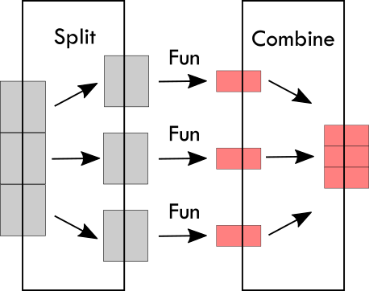
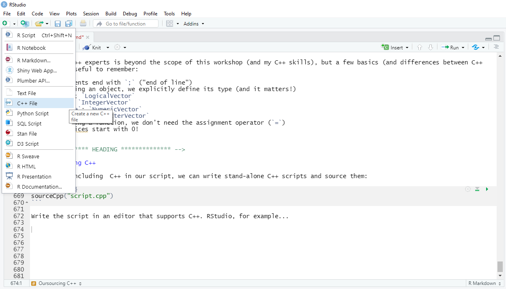
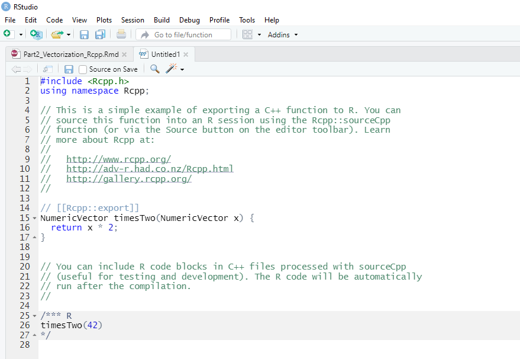

```{r setup, include=FALSE, message = FALSE, warning=FALSE}
options(htmltools.dir.version = FALSE)
library(plyr)
library(tidyverse)
library(kableExtra)
library(doParallel)
library(Rcpp)
sourceCpp("subfiles/pwr_binom.cpp")
```


## Remember the Risk of Optimization

.pull-left[

- Can save a lot of time, but also can waste a lot of time

- There is often no single-best solution

- Still often worth to profile your functions or simulation code


]
.pull-right[


from [xkcd](https://xkcd.com/)
]


<!-- *********** HEADING ************** -->
---
class: heading,middle


Part 2: Vectorization &  Rcpp


<!-- *********** HEADING ************** -->
---
## Working with Vectors

Many functions take vector input and return single result:

```{r}
x <- c(1,2,3,4,5,6)
mean(x)

t.test(x)
```


<!-- *********** HEADING ************** -->
---
## Working with Elements

Sometimes, we want to apply a function to elements of an object

**Example**: Simple recognition experiment (*N* = 10). Before data analysis we exclude participants whose accuracy does not exceed chance level (one-sided binomial test).

**The data**:

```{r echo=F}
x <- read.csv("Data/rec_exp.csv")
x
```

<!-- *********** HEADING ************** -->
---
## A Marker of R Experience

**The novice:**

```{r eval=F}
n <- ncol(x)
test1 <- binom.test(x = sum(x[1,]), n = n, p = .5, alternative = "greater")
test2 <- binom.test(x = sum(x[2,]), n = n, p = .5, alternative = "greater")
test3 <- binom.test(x = sum(x[3,]), n = n, p = .5, alternative = "greater")
...
test1

```
```{r echo=F}
n <- ncol(x)
test1 <- binom.test(sum(x[1,]), n = n, p = .5, alternative = "greater")
test1
```

Hands down, we have all done something like that at some point! 

<!-- *********** HEADING ************** -->
---
## The Infamous Loop

**The Experienced User:**

```{r}
n <- ncol(x)
res <- vector(mode = "list", length = nrow(x)) 
# res <- list()
for(i in 1:nrow(x)){
  k <- sum(x[i,])
  res[[i]] <- binom.test(k, n, .5, "greater")
}
res[[1]]
```

Faster and more elegant. 


<!-- *********** HEADING ************** -->
---
## Very R: Vectorization

**The Expert:**

- R is a very high-level language
- Loops on R level call R functions repeatedly
- **Vectorization** basically corresponds to low-level loop

**Problem 1:** Not all functions are vectorized (for a reason).

*Bad:*

```{r}
acc <- numeric(nrow(x))
for(i in 1:nrow(x)){
  acc[i] <- mean(as.numeric(x[i,]))
}
```

*Better:*

```{r}
acc <- rowMeans(x)
```

**Problem 2:** There is no `rowBinom.test()`...

<!-- *********** HEADING ************** -->
---
class: heading,middle


Vectorize with `Vectorize()` 

<!-- *********** HEADING ************** -->
---
## Vectorize Your Own Functions

To create our own vectorized function, we can use 

```{r eval=F}
function_name <- Vectorize(function(arg1, arg2, arg3...){
  
  ...
  
}, c("arg1", "arg2"))
```

**Example:** 

```{r}
binom.test.vectorized <- Vectorize(function(x, n, p, alternative, conf.level){
  binom.test(x, n, p, alternative, conf.level)
}, "x")

rowBinom.test <- function(x){
  y <- rowSums(x)
  binom.test.vectorized(y, ncol(x), .5, "greater", .95)
}
```


<!-- *********** HEADING ************** -->
---
## Vectorize Your Own Functions

```{r}
res <- rowBinom.test(x)
typeof(res); dim(res)
```

The output is not too convenient, but we got what we wanted:

```{r}
tmp <- res[,1]
class(tmp) <- "htest"
print(tmp)
```


<!-- *********** HEADING ************** -->
---
## Vectorize Your Own Functions


A much more realistic scenario: **Plotting functions**.

**Example:** Plot marginal likelihood of simple normal-normal model.

.pull-left[

Model:

$$X|\mu \sim \text{Normal}(\mu, 1)\\
\mu \sim \text{Normal}(a, b)$$

Marginal Likelihood:

$$\int_{-\infty}^{\infty}\dfrac{1}{\sqrt{2\pi}}\text{exp}\left(- \dfrac{(x-\mu)^2}{2} \right) \dfrac{1}{\sqrt{2\pi b}}\text{exp}\left(- \dfrac{(\mu-a)^2}{2b} \right)\ d\mu$$
]

.pull-right[

```{r echo=F, fig.width = 5, fig.asp=.7, fig.align="right"}
ggplot(data.frame(x=0), aes(x)) +
  stat_function(fun = dnorm, args = list(sd = sqrt(2)),
                xlim = c(-5, 5), lwd = 1, n = 300) +
  scale_x_continuous("X", expand=c(0,0.15)) +
  scale_y_continuous(element_blank(), expand = c(0,0), limits = c(0, .29)) +
  theme_classic() + 
  theme(axis.line.y = element_blank(),
        axis.text.y = element_blank(),
        axis.ticks.y = element_blank(),
        axis.text.x = element_text(color = "black"),
        text = element_text(size = 20))
```


]

**Your turn!**

(Choose any values for a, b; e.g., 0, 1)


<!-- *********** HEADING ************** -->
---
class: heading,middle


Dreaded and Beautiful: `apply()` 


<!-- *********** HEADING ************** -->
---
## The apply() Family

The general idea:


.center[




]


<!-- *********** HEADING ************** -->
---
## The apply() Family: Overview

```{r eval = F}
# for matrices and arrays:
?apply

# for lists and vectors (differ in the type of output):
?lapply # l = "list"
?sapply # s = "simplify"
?vapply # v = "vector" (robust output)

# other apply functions:
?mapply    # multiple arguments
?replicate # repeated evaluation of expr
?tapply    # summary statistics split by factor(s)
?aggregate # aggregate to summary statistic split by factor(s)

...
```

Many have wasted more time trying to get an `apply()` function to work than they saved by actually using it.

Once you know how to use them, they are beautiful.


<!-- *********** HEADING ************** -->
---
## apply()


Apply function over elements in one dimension of an array:

```{r echo=T, eval=F}
apply(X,       # the array (matrix) to which FUN is applied
      MARGIN,  # dimensions to which FUN is applied
      FUN)     # function to apply
```

Note: `MARGIN` denotes those dimensions *which FUN takes as argument*:

- MARGIN = 1: function is applied to each row
- MARGIN = 2: function is applied to each column
- ...

Can we use `apply()` to identify cases to exclude?


<!-- *********** HEADING ************** -->
---
## apply(): Example

Of course, we can.

But we need a suitable function. `binom.test()` doesn't work with response vectors.

```{r}
new_binom_test <- function(x, p, alternative, conf.level){
  y <- sum(x)
  n <- length(x)
  binom.test(y, n, p, alternative, conf.level)
}
```

This one we can `apply()` to our data frame:

```{r}
res <- apply(x, 1, new_binom_test, .5, "greater", .95)
res[[1]]
```


<!-- *********** HEADING ************** -->
---
## Wait a Minute...

Did `apply()` really help us? 

If we have to manually inspect each individual result, we could've gone with the novice's solution.

Is there a nice and efficient way to extract each individual's *p*-value from our list of results (`res`)?

**Your turn:**

Create a vector that contains all *p*-values.

*Hint:* Everything that happens in `R` is a function. Really, everything:

```{r}
`+`(1, 1)
`<-`(a, "Hello"); print(a)
`[`(x, , 1)
```


<!-- *********** HEADING ************** -->
---
class: heading,middle


`apply()`'s Powerful Sister

<!-- *********** HEADING ************** -->
---
## The `plyr` Package

Even more efficient and extremely elegant alternative to the `apply` family: The `plyr` package

Each function is named according to the structure they accept (*split*) and that which they return (*combine*):

- **a**: array
- **l**: list
- **d**: data.frame
- **m**: multiple inputs
- **r**: repeat
- _: nothing

```{r echo=T, eval=F}
ldply() # accepts a list, returns a data.frame
maply() # accepts multiple args, returns an array
...
```


<!-- *********** HEADING ************** -->
---
## Why `__ply()`?

Very much unlike the `apply()` family, the functions are consistent.

**Input** and **Output** are clearly defined.

They are **efficient and fast**.

Offer nice options such as **progress bars** or **parallelization**.


My favorite go-to **Example:** Combining multiple data files

- We have 448 data sets from a simulation study (.RData files)
- We want to read in the files and combine them into one big data frame
- Obviously, we don't want to use a loop (that takes several minutes)


<!-- *********** HEADING ************** -->
---
## The `lapply()` Solution

```{r}
files <- list.files(path = "Data/sprt/", pattern = "*.RData", full.names = TRUE)
```

We need a function that returns the data frame:

```{r eval=F}
load("x") # loads the file x, returns object's name
get(x) # returns an object named x

# Let's combine them
get(load("x"))
```

Let's `lapply()` the function:

```{r eval=F}
data <- lapply(files, function(x) get(load(x)))
```

Hm, a list of data frames... we need one last trick:

```{r eval = F}
data <- do.call(rbind, data)
```

**Can you do it faster with `plyr`?**


<!-- *********** HEADING ************** -->
---
## Parallelization

One advantage of the ply() functions is the built-in parallelization option.

That means that the iterated process is processed on multiple cores in parallel. 

This is almost like splitting the process in little pieces and let distribute these pieces across multiple computers.

To use parallelization, we need to **register a parallel backend**.

```{r eval=F}
library(doParallel)
```

One way to register a backend:

```{r eval=F}
cl <- makeCluster(8)
registerDoParallel(cl)
```


<!-- *********** HEADING ************** -->
---
## Parallelization: Example from the Field

Consider this very simple problem: We want to perform a one-sided one-sample binomial test. Let's check if toast is really more likely to land on the butter side. Or cats to land on their feet...

Turns out, an exact power analysis for a simple binomial test is not that simple. No analytical solution (only approximations).

**Idea:** A power simulation:

```{r}
power_simulation <- function(n, p1, p0, alpha, nRep) {
  k <- rbinom(nRep, n, p1)
  p <- pbinom(k-1, n, p0, lower.tail = FALSE)
  mean(p < alpha)
}
```

Assume the following parameters:

- p0 = .50
- p1 = .55
- n = 50, 55, 60, ..., 5000


<!-- *********** HEADING ************** -->
---
## Parallelization: Example from the Field

Let's compare different ways to do this simulation:

```{r echo=F}
cl <- makeCluster(8)
registerDoParallel(cl)
```

```{r message = FALSE, warning=FALSE}
ns <- seq(50, 5000, 5)
nRep <- 10000

timing <- bench::mark(
  loop = for(n in ns){power_simulation(n, .6, .5, .05, nRep)},
  serial = sapply(ns, power_simulation, p1 = .6, p0 = .5, alpha = .05, nRep = nRep),
  serial2 = laply(ns, .fun = power_simulation, p1 = .6, p0 = .5, alpha = .05, nRep = nRep),
  parallel = laply(ns, .fun = power_simulation, p1 = .6, p0 = .5, alpha = .05, nRep = nRep, .parallel = TRUE),
  check = F
)
```

```{r echo=F}
stopCluster(cl)
timing[,1:8]
```


<!-- *********** HEADING ************** -->
---
class: heading,middle


Back to the Roots: Using C++ in R


<!-- *********** HEADING ************** -->
---
## When Vectorization Fails

Vectorization makes R code elegant and fast. When it's possible.

Sometimes, expressions can't be vectorized. For example, when code relies on a previous result. Or when vectorization results in unnecessary operations.

**Power Analysis Revisited:** Instead of a power simulation, we want to do an iterative search to find the smallest N for a binomial test that satisfies power requirements

This search is along these lines:

```{r eval=F}

alpha; beta; p0; p1
n <- start_value

while(b > beta){
  c <- qbinom(1 - alpha, n, p0)
  b <- pbinom(c, n, p1)
  n <- n + 1
}

sample_size = n - 1
crit_value = c + 1
actual_beta = b

```


<!-- *********** HEADING ************** -->
---
## A Vectorization Attempt

"Iterative Search" is a clear indication for a loop. Depending on the hypotheses, good luck with that...

$$\mathcal H_0\!:\ p = .50\\ \mathcal H_1\!:\ p = .505\\$$
The required sample size for $\alpha$ = $\beta$ = .05 is $N = 108,339$. A loop might take ages in situations like these.

The problem is simple to address with vectorization:

```{r}
pwr_binom_r <- function (p0, p1, alpha, beta, nLow=1, nUp=10000){
  n <- nLow:nUp
  crit <- qbinom(1 - alpha, n, p0)
  b <- pbinom(crit, n, p1)
  i <- which.max(b <= beta)
  return(c(n[i], crit[i]+1))
}
```

<!-- *********** HEADING ************** -->
---
## The Pitfall of Vectorization

In my vectorized function, I have to define the vector over which the search will be conducted. 

If the vector doesn't include the correct value, it cannot be found.

The larger my search grid gets, the less efficient is my function. 

A loop can stop as soon as it finds the correct value. A vectorized function can't. 

**Solution:** Implement search algorithm directly in C++


<!-- *********** HEADING ************** -->
---
## Using C++ in R

The implementation of C++ in R is straightforward. We need the following package:

```{r, eval=F}
library(Rcpp)
```

and a C++ compiler (Windows: Rtools; Mac:Xcode).

We can then directly create C++ function from within our R script.

```{r echo=T}
cppFunction('String cpp_demo() {
  return "Hello World!";
}')
```

Not a particularly useful function, but it works:
```{r}
cpp_demo()
```

The function is now available from the Global Environment.


<!-- *********** HEADING ************** -->
---
## Some C++ Basics

Making you C++ experts is beyond the scope of this workshop (and my C++ skills), but a few basics (and differences between C++ and R) are useful to remember:

- All statements end with `;` ("end of line")
- When creating an object, we explicitly define its type (and it matters!)
    - `bool`; `LogicalVector` 
    - `int`; `IntegerVector`
    - `double`; `NumericVector`
    - `String`; `CharacterVector` 
- When creating a function, we don't need the assignment operator (`=`)
- Vector indices start with 0!


<!-- *********** HEADING ************** -->
---
## Outsourcing C++

Instead of including  C++ in our script, we can write stand-alone C++ scripts and source them:

```{r eval=F}
sourceCpp("script.cpp")
```

Write the script in an editor that supports C++. RStudio, for example...


.center[




]


<!-- *********** HEADING ************** -->
---
## A .cpp Script

.center[




]


<!-- *********** HEADING ************** -->
---
## An example

Let's create a simple function that creates an integer vector with defined end points:

```{r eval = F}
#include <Rcpp.h>
using namespace Rcpp;

// [[Rcpp::export]]
NumericVector seqC(int x, int y) {
  
  int len = y - x + 1;
  NumericVector out(len);
  
  for(int i = 0; i < len; i++) {
    out[i] = x;
    x++;
  }
  return out;
}
```

```{r}
sourceCpp("subfiles/seqC.cpp")
seqC(1, 10)
```


<!-- *********** HEADING ************** -->
---
## Benchmarking

Of course, it makes little sense to recreate functions that already exist. Built-in functions are highly optimized. It's basically impossible to beat that:

```{r}
timing <- bench::mark(
  R = 1:1000,
  R2 = seq(1, 1000, 1),
  cpp = seqC(1, 1000),
  iterations = 1000
)
```

```{r}
timing[, 1:8]
```


<!-- *********** HEADING ************** -->
---
class: small
## Power Analysis Revisited


```{r eval=F}
#include <Rcpp.h>
using namespace Rcpp;
using namespace R;


// [[Rcpp::export("pwr_binom_cpp")]]
NumericVector pwr_binom(double p0, double p1, double alpha, double beta, int nLow = 1, int nUp = 1000000){
  
  NumericVector out(2);
  int n = nLow;
  int c;
  double b;
  
  do {
    c = R::qbinom(1 - alpha, n, p0, true, false);
    b = R::pbinom(c, n, p1, true, false);
    n++;
  } while (n < nUp && b > beta);
  
  if (b <= beta)
  {
    out[0] = n - 1;
    out[1] = c + 1;
  } else
  {
    out = NAN;
  }
  
  return out;
}
```


<!-- *********** HEADING ************** -->
---
## Final Benchmarking

How does the C++ function compare to our vectorized solution?

```{r}
p0 <- .5
p1 <- .55
alpha <- beta <- .05

timing <- bench::mark(
  cpp = pwr_binom_cpp(p0, p1, alpha, beta),
  R = pwr_binom_r(p0, p1, alpha, beta),
  iterations = 500
)
```

```{r}
timing
```

<!-- *********** HEADING ************** -->
---
## Final Benchmarking

```{r fig.width=12, fig.asp = .6, fig.align="center"}
autoplot(timing) + theme_bw() + theme(legend.position = "none")
```


<!-- *********** HEADING ************** -->
---
## Your Turn!

- Open the file `Rcpp_exercise.R` in the `Exercise` folder.
- Write some nice and efficient C++ code.


.center[


]

